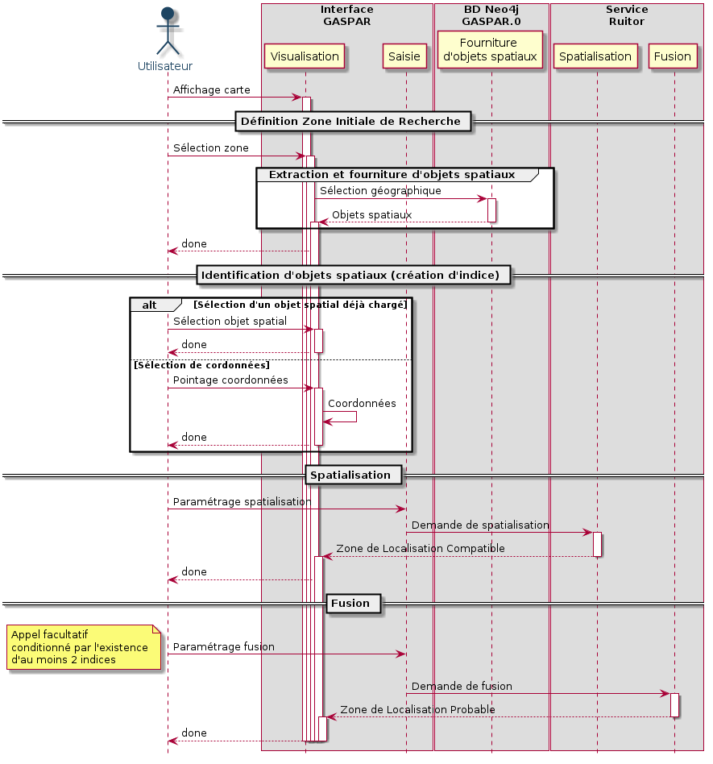

# WPSequenceDiagram

Choucas Workpackage Interaction Sequence Diagram


Updated version for 26/01/2021 meeting :



## Dependances

Plantuml: http://plantuml.com/

## Diagram Construction instructions

Clone the repository:

```bash
git clone https://github.com/ANRChoucas/WPSequenceDiagram
cd ./WPSequenceDiagram
```

Using the makefile (png version):

```bash
# png version
make
```

Using the makefile (svg version):

```bash
# svg version
make create_svg
```
Manualy (local):

```bash
# png version
plantuml *.plantuml

# svg version
plantuml -tsvg *.plantuml
```

Manualy (on web):

Go to: https://www.planttext.com/


## Diagram Modifications

Documentation: http://plantuml.com/en/sequence-diagram
